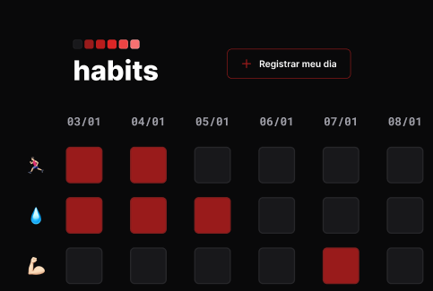

<h1 align="center"> Habits Project </h1>

Esta é minha primeira aplicação, desenvolvida durante o primeiro NLW de 2023, um evento promovido pela Rocketseat para ensino de tecnologias WEB.  

  <a href="#-tecnologias">Tecnologias</a>&nbsp;&nbsp;&nbsp;|&nbsp;&nbsp;&nbsp;
  <a href="#-projeto">Projeto</a>&nbsp;&nbsp;

  

 

  

## 🚀 Tecnologias

Esse projeto foi desenvolvido com as seguintes tecnologias:

- HTML e CSS
- JavaScript
- Git e Github
- Figma

## 💻 Projeto

O Habits é um app para ajudar a rastrear e registrar os hábitos diariamente.

- [Visite o projeto online](https://eudenio-nogueira.github.io/Habits-project/Habits-nlw-setup/)
